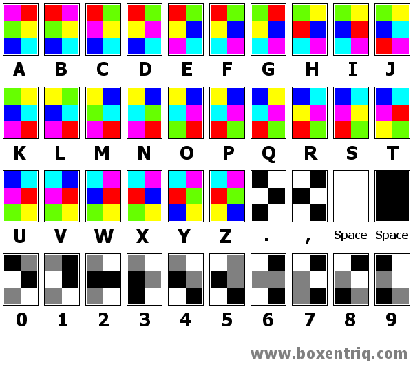

# CTF Toolkit 
This CTF Toolkit contains tools that can be used in Capture the flag competion locally on your kali linux.As during some CTF you are not allowed to use google or AI to solve the cipher,this could be your weapon.

## ASCII-to-char
Converts the ASCII codes to Charachter.Currently this code only converts the ASCII decimal codes to the respective Charachter.

## Char-to-ASCII
Return the ASCII decimal code when Charachter are provided.

## Colour_Cipher_Decrypt

This is a CLI for decrypting Colour Cipher.Each colour is recognised with their initials  :-
** B:Blue, C:Cyan, G:Green, P:pink, R:Red, Y:Yellow **

## Colour_Cipher_Encrypt
This is the reverse of the Colour_Cipher_Decrypt CLI.You provide the code and that gives you the word.the input code has to be in all CAPS as the program can break if not like PRGCBY.If the code does not exists then it will return "invalid input"

###### * Currently this code only returns alphabet and not numbers as shown in the image *

## CCE-f : Colour cipher encryption and decryption in one program and GUI
This part i havent yet started coding but it will be GUI 